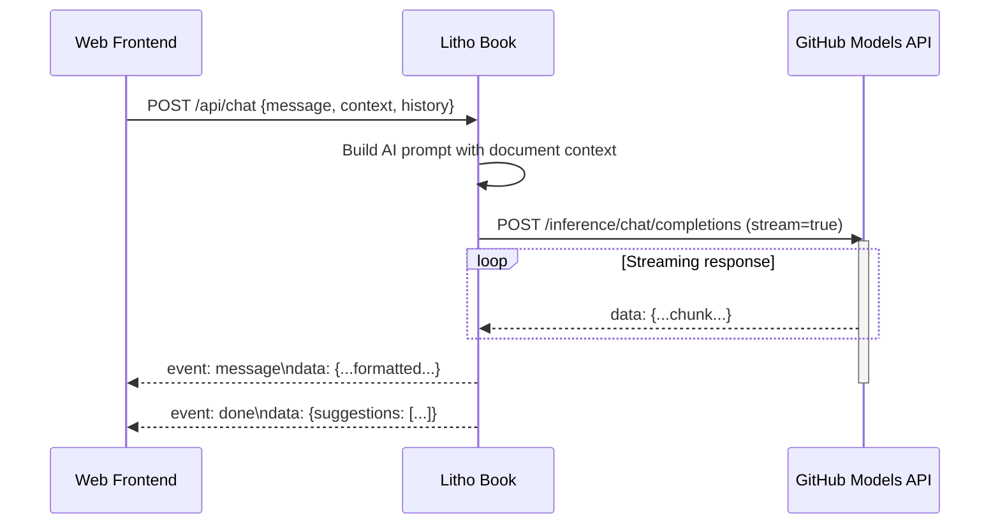
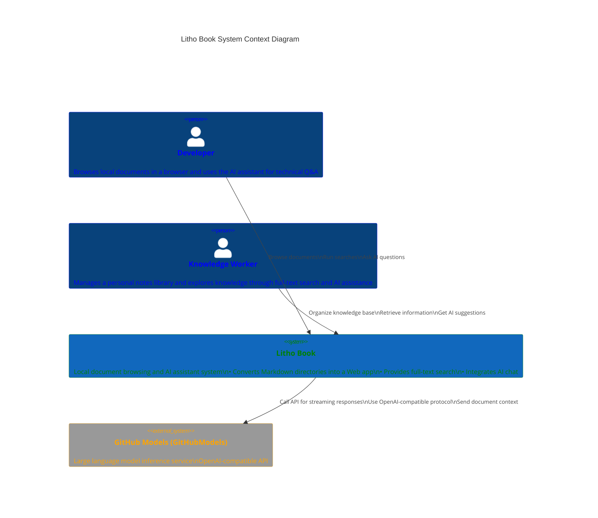
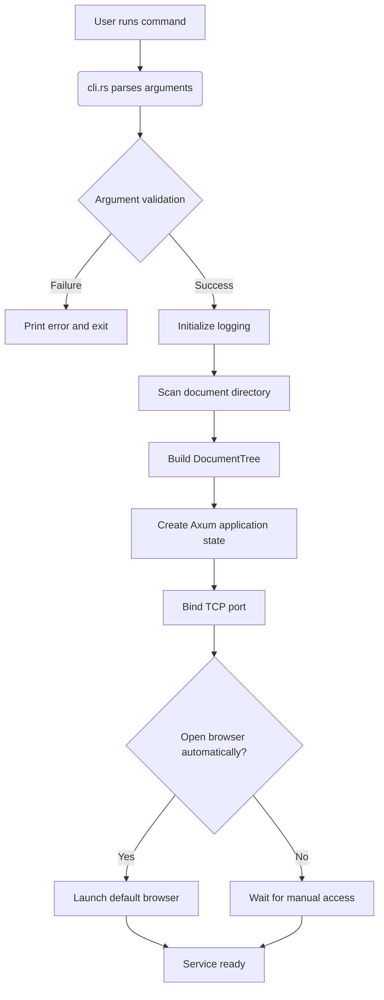
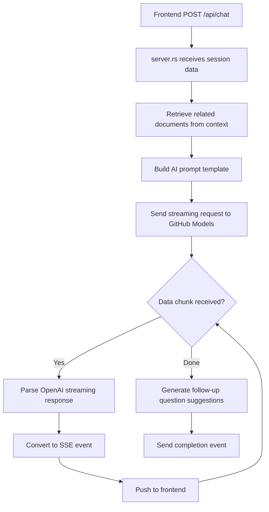

# System Overview (System Context)

## 1. Project Introduction

### Project Name
**Litho Book**

### Project Description
Litho Book is a local document browsing and AI assistant system that combines a command-line tool with an embedded Web service. It is designed for developers and knowledge workers. It turns a local Markdown document directory into a searchable, browsable Web application and integrates AI chat to improve the knowledge exploration experience.

By building a structured document tree, providing full-text retrieval, and using an external AI service for natural-language Q&A, the system significantly improves the accessibility and efficiency of a personal knowledge base. Its core value is converting scattered local documents into a unified, intelligent knowledge-management system that supports efficient information retrieval and content creation.

### Core Capabilities and Value
- **Structured document display**: Automatically scans local Markdown directories and builds a hierarchical document tree.
- **Full-text search engine**: Supports keyword search with relevance ranking based on heading weight, term frequency, and context extraction.
- **Web browsing interface**: Lets users read local documents in a modern browser experience.
- **AI-enhanced Q&A**: Integrates an external large-model API so users can ask natural-language questions about document content.
- **Offline-first architecture**: Keeps documents local and only calls the external AI service when needed, protecting data privacy.

### Technical Characteristics
- **Programming language**: Rust, emphasizing safety, performance, and memory efficiency.
- **Web framework**: Axum, an asynchronous HTTP framework based on Tokio.
- **Runtime mode**: CLI startup with an embedded Web server.
- **Communication protocol**: HTTP/REST plus Server-Sent Events (SSE) streaming responses.
- **Deployment model**: Single-machine execution without a complex deployment process.
- **Extension mechanism**: External AI service integration through an OpenAI-compatible API.

---

## 2. Target Users

### User Roles

| Role | Description |
|------|-------------|
| **Developer** | Software engineers who manage code documentation, API notes, and technical notes as local Markdown files. |
| **Knowledge worker** | Scholars, researchers, or content creators who need to organize and search large collections of personal notes, book summaries, and research material. |

### Usage Scenarios

#### Scenario 1: Fast Technical Documentation Lookup
During development, developers frequently need to consult project documentation, API manuals, or study notes. With Litho Book, they can:
- Start the service and automatically open the browser.
- Navigate to target documents through a structured directory.
- Use full-text search to quickly locate specific knowledge points.
- Use the AI assistant to understand complex concepts or obtain sample code.

#### Scenario 2: Academic Research Material Management
Researchers accumulate large volumes of literature notes and experiment records. Litho Book helps them:
- Manage Markdown notes scattered across different folders in one place.
- Search across documents by keyword.
- Use the AI assistant to summarize literature or generate writing suggestions.
- Operate fully locally so sensitive research data is not exposed.

#### Scenario 3: Personal Knowledge Base Building
Content creators who want to build a digital garden can use Litho Book for:
- A clean, pleasant document browsing interface.
- A foundation for bidirectional links and knowledge graphs.
- Customizable metadata and tag structures.
- AI-assisted content generation and reorganization.

### User Needs Analysis

| User type | Core need | How the system satisfies it |
|-----------|-----------|-----------------------------|
| Developer | Quickly browse a local document directory | Automatically generates a document tree and renders it as HTML. |
| Developer | Full-text search over document content | Implements a weighted full-text search engine. |
| Developer | Structured display in the browser | Provides a responsive Web interface. |
| Developer | Ask AI questions about document content | Integrates an external AI API for streaming chat. |
| Knowledge worker | Manage scattered Markdown files uniformly | Scans a specified directory and builds a document tree. |
| Knowledge worker | Locate information quickly by keyword | Supports highlighted search results. |
| Knowledge worker | Obtain context-aware AI Q&A | Builds prompts from document content. |
| Knowledge worker | Use offline without cloud upload | Runs locally; only AI requests go outbound. |

---

## 3. System Boundary

### Scope Definition
Litho Book's core responsibility is to act as a **local document server and AI-enhanced knowledge exploration system**. It focuses on turning static Markdown files into a dynamic, interactive knowledge platform. The system has clear boundaries that define included and excluded functionality.

### Included Core Components

| Component | File path | Responsibility |
|-----------|-----------|----------------|
| **Command-line interface** | `src/cli.rs` | Parses user arguments and validates configuration. |
| **Filesystem scanner** | `src/filesystem.rs` | Recursively scans the document directory and builds the in-memory `DocumentTree`. |
| **Unified error handling** | `src/error.rs` | Defines application error types and maps them to HTTP status codes. |
| **Axum HTTP service** | `src/server.rs` | Provides RESTful APIs and SSE streaming responses. |
| **Main coordinator** | `src/main.rs` | Coordinates module initialization and service startup. |

Together, these components provide five core capabilities:
1. Argument parsing and validation.
2. Document-tree construction and indexing.
3. Web-service routing and responses.
4. Error handling and log output.
5. Service lifecycle management.

### Excluded External Dependencies

| Excluded item | Alternative / explanation |
|---------------|---------------------------|
| Front-end React/Vue application | Uses lightweight HTML templates and JavaScript rendering to avoid front-end framework complexity. |
| Markdown file generation tool | Focuses on document consumption rather than authoring; it does not edit or create files. |
| Document version control, such as Git | Does not interfere with source-file storage and remains compatible with any version-control system. |
| User authentication and authorization | Open by default for personal, single-machine usage. |
| Cloud-storage synchronization | Keeps data fully local and does not provide automatic sync. |
| AI model training or fine-tuning | Acts only as a client for external inference services; it does not train models. |

This boundary follows a separation-of-concerns design philosophy, keeping the system focused, lightweight, and maintainable.

---

## 4. External System Interaction

### External Systems

| External system | Interaction type | Protocol | Direction | Purpose |
|-----------------|------------------|----------|-----------|---------|
| **GitHub Models (GitHubModels) OpenAI-compatible API** | HTTP/REST | HTTPS | Outbound | Obtain streaming AI chat responses. |

### Interaction Details

#### Communication Protocol
- **Basic communication**: HTTPS REST API.
- **Streaming transport**: AI responses wrapped as Server-Sent Events (SSE).
- **Data format**: JSON-serialized request and response bodies.
- **Authentication**: The GitHub Models API token is provided through the `GITHUB_TOKEN` environment variable; tokens must not be hardcoded in source or documentation.

#### Request Flow


### Dependency Analysis

#### Dependency Strength Assessment
| Dependency | Strength (0-10) | Impact | Fault-tolerance strategy |
|------------|------------------|--------|--------------------------|
| GitHub Models API | 8.0 | AI assistant unavailable | Degrade to search-only mode and log errors. |
| Local filesystem | 10.0 | Entire system cannot start | Provide a clear error message and exit. |
| Network connection | 6.0 | Only AI features are affected | Cache failed requests and provide retry options. |

#### Security and Privacy Considerations
- **Data minimization**: Send only necessary document fragments as context.
- **Local first**: Document content is never uploaded except for selected AI context.
- **Credential protection**: Inject `GITHUB_TOKEN` securely; never hardcode it.
- **Timeout control**: Use reasonable connection and read timeouts to avoid resource exhaustion.

---

## 5. System Context Diagram

### C4 Model - System Context Diagram



### Key Interaction Flows

#### 1. Project Startup and Service Initialization


#### 2. Document Full-Text Search


#### 3. AI Assistant Streaming Chat


### Architecture Decisions

| Decision | Choice | Rationale |
|----------|--------|-----------|
| **Technology stack** | Rust + Axum | High performance, memory safety, and suitability for system tools. |
| **Deployment model** | CLI + embedded server | Lowers the barrier to use and avoids extra deployment steps. |
| **Front-end approach** | Lightweight HTML/JS | Avoids front-end build complexity and focuses on core features. |
| **AI integration** | OpenAI-compatible API via GitHub Models | Keeps the protocol standard while using GitHub Models and `GITHUB_TOKEN`. |
| **Data storage** | In-memory document tree | Improves search performance and simplifies architecture. |
| **Communication** | SSE streaming | Provides low-latency AI conversation. |

---

## 6. Technical Architecture Overview

### Main Technology Stack

| Layer | Technology | Version requirement | Purpose |
|-------|------------|---------------------|---------|
| Runtime | Rust | 1.70+ | High-performance, memory-safe execution environment. |
| Async runtime | Tokio | 1.x | Handles concurrent network requests. |
| Web framework | Axum | 0.6+ | Builds type-safe HTTP routes. |
| CLI tool | Clap | 4.x | Parses command-line arguments. |
| Logging | Tracing | 0.1.x | Structured logging and debugging. |
| JSON | Serde | 1.x | Efficient serialization and deserialization. |
| HTTP client | Reqwest | 0.11+ | Calls the external AI API. |
| Markdown rendering | comrak / Pulldown-Cmark | 0.20+ / project version | Converts `.md` files to HTML. |

### Architecture Pattern

#### Layered Architecture
```
┌─────────────────┐
│ User Interaction │ ← CLI argument parsing & Web API responses
├─────────────────┤
│ Document Data    │ ← Document-tree construction & full-text search
├─────────────────┤
│ System Support   │ ← Error handling & startup coordination
└─────────────────┘
```

#### Module Responsibilities
| Module | Responsibility | Dependencies |
|--------|----------------|--------------|
| `main.rs` | System startup coordinator | cli, filesystem, server |
| `cli.rs` | Command-line interface | clap, std::path |
| `filesystem.rs` | Document data management | serde, std::collections |
| `server.rs` | Web service interface | axum, tower-http, futures |
| `error.rs` | Unified error handling | thiserror, axum::http |

### Key Design Decisions

#### 1. In-Memory Document Tree
- **Decision**: Load the entire document directory into memory as a `DocumentTree`.
- **Advantages**:
  - Fast search response through direct access.
  - Supports more sophisticated full-text retrieval algorithms.
  - Reduces disk I/O.
- **Trade-offs**:
  - Memory usage grows linearly with the number of documents.
  - Startup is slightly slower than on-demand loading.

#### 2. Single-Process Architecture
- **Decision**: Run all functionality in one process.
- **Advantages**:
  - Simple deployment with one executable.
  - Efficient in-process module communication.
  - Easy debugging and monitoring.
- **Suitable for**:
  - Personal knowledge management.
  - Small and medium document libraries, typically fewer than 10,000 files.

#### 3. External AI Service Integration
- **Decision**: Call GitHub Models through the OpenAI-compatible API using `GITHUB_TOKEN`.
- **Advantages**:
  - No local GPU requirement.
  - Models can be upgraded independently.
  - Cost and access are managed externally.
- **Risk mitigation**:
  - Provide offline degradation for browsing and search.
  - Keep the AI-call boundary isolated.
  - Avoid hardcoded credentials.

#### 4. Streaming Response Design
- **Decision**: Use Server-Sent Events (SSE) for AI chat.
- **User-experience benefits**:
  - Users see the first tokens immediately.
  - The system feels responsive while the model is generating.
  - Long answers can be rendered progressively.
- **Technical implementation**:
  ```rust
  async fn chat_stream_handler(...) -> Sse<impl Stream<Item = Event>> {
      let stream = async_stream::stream! {
          // Forward the external AI streaming response.
          while let Some(chunk) = ai_response.next().await {
              yield Event::default().data(format!("..."));
          }
      };
      Sse::new(stream)
  }
  ```

### Performance and Maintainability Metrics

| Metric | Current behavior | Optimization direction |
|--------|------------------|------------------------|
| Startup time | ~500 ms for 100 files | Incremental updates and cached snapshots. |
| Search latency | <50 ms on average | Inverted-index optimization. |
| Memory usage | ~2 KB per file | Compressed storage and lazy loading. |
| Error coverage | 95%+ | Add tests for edge cases. |
| Build time | <30 s | Enable incremental compilation. |

This system-context document describes the overall architecture of Litho Book and provides a foundation for more detailed container- and component-level design, technical decision-making, collaboration, and future evolution.
