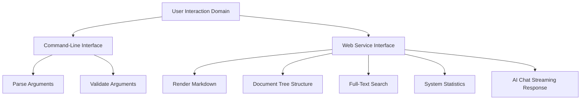
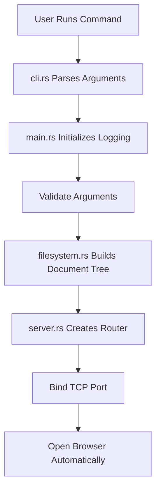
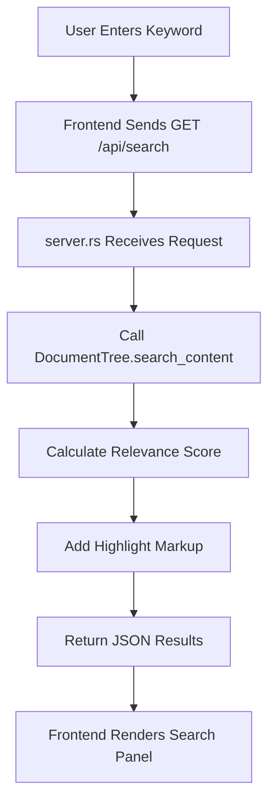
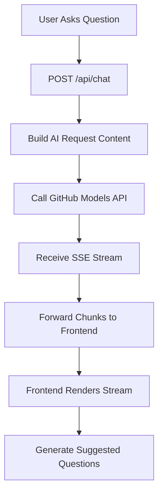

# Litho Book User Interaction Domain Technical Implementation

## 1. Module Overview

### 1.1 Module Positioning and Core Value
The user interaction domain is one of the core business domains of **Litho Book**. As the only entry point into the system, it bridges user intent and system capabilities. This module handles all forms of user input, including command-line arguments and Web interface requests, and returns system responses to users in the appropriate format.

The module follows the separation-of-responsibilities principle and is divided into two main submodules:
- **Command-line interface (CLI)**: receives and validates configuration when the application starts.
- **Web service interface**: provides RESTful APIs for frontend interaction.

Through these two channels, users can complete the full loop from system startup to knowledge exploration.

### 1.2 Architecture Relationship Diagram


## 2. Command-Line Interface Implementation

### 2.1 Technology Choices and Dependencies
The CLI is built on the widely used Rust `clap` crate (v4.5). It uses declarative derive macros for type-safe argument parsing. Key dependency:
```toml
[dependencies]
clap = { version = "4.5", features = ["derive"] }
```

### 2.2 Argument Definition and Parsing
The complete command-line argument structure is defined with the `#[derive(Parser)]` macro:

```rust
#[derive(Parser, Debug)]
#[command(name = "litho-book")]
#[command(about = "A web-based reader for litho-generated documentation")]
#[command(version)]
pub struct Args {
    /// Documentation directory path
    #[arg(short, long, value_name = "DIR")]
    pub docs_dir: PathBuf,
    
    /// Server port
    #[arg(short, long, default_value = "3000", value_name = "PORT")]
    pub port: u16,
    
    /// Bind host
    #[arg(long, default_value = "127.0.0.1", value_name = "HOST")]
    pub host: String,
    
    /// Open browser automatically
    #[arg(short, long)]
    pub open: bool,
    
    /// Enable verbose logs
    #[arg(short, long)]
    pub verbose: bool,
}
```

Example standard invocation:
```bash
litho-book --path ./docs --port 3000 --open --verbose
```

### 2.3 Argument Validation
Comprehensive validation ensures the system starts in a reliable state.

#### 2.3.1 Directory Validity Check
```rust
impl Args {
    pub fn validate(&self) -> anyhow::Result<()> {
        if !self.docs_dir.exists() {
            anyhow::bail!("Documentation directory does not exist: {}", self.docs_dir.display());
        }
        
        if !self.docs_dir.is_dir() {
            anyhow::bail!("Path is not a directory: {}", self.docs_dir.display());
        }
        
        Ok(())
    }
}
```

#### 2.3.2 Port Permission Check
For low ports (<1024), which require administrator privileges, the implementation provides cross-platform detection logic:

```rust
if self.port < 1024 && !is_privileged() {
    anyhow::bail!(
        "Port {} requires administrator privileges. Please use a port >= 1024 or run as administrator.",
        self.port
    );
}

fn is_privileged() -> bool {
    #[cfg(unix)]
    unsafe { libc::geteuid() == 0 }
    
    #[cfg(windows)]
    true // Simplified Windows implementation
    
    #[cfg(not(any(unix, windows)))]
    false
}
```

#### 2.3.3 Service Address Generation
Convenience methods generate service access addresses:

```rust
pub fn server_url(&self) -> String {
    format!("http://{}:{}", self.host, self.port)
}

pub fn bind_address(&self) -> String {
    format!("{}:{}", self.host, self.port)
}
```

## 3. Web Service Interface Implementation

### 3.1 Technology Stack and Framework
The Web service is built with **Axum** and the Tokio async runtime for high-performance HTTP service. Main technologies:
- **Axum**: routing, extractors, middleware, and other Web capabilities.
- **Tokio**: asynchronous task scheduling and network I/O.
- **Tower HTTP**: CORS middleware support.
- **Serde**: JSON serialization and deserialization.
- **Futures**: asynchronous stream processing.

### 3.2 Core Data Structures
#### 3.2.1 Application State Management
`AppState` manages shared state uniformly and provides consistency across requests:

```rust
#[derive(Clone)]
pub struct AppState {
    pub doc_tree: DocumentTree,
    pub docs_path: String,
}
```

This state is injected into all route handlers through Axum's `.with_state()` method.

#### 3.2.2 Request/Response Models
Standardized API data contracts are defined as follows:

| Endpoint | Request Model | Response Model |
|------|----------|----------|
| `/api/file` | `FileQuery` | `FileResponse` |
| `/api/search` | `SearchQuery` | `SearchResponse` |
| `/api/chat` | `ChatRequest` | SSE `StreamEvent` |

### 3.3 Route Registration and Handling
#### 3.3.1 Route Configuration
```rust
pub fn create_router(doc_tree: DocumentTree, docs_path: String) -> Router {
    let state = AppState { doc_tree, docs_path };
    
    Router::new()
        .route("/", get(index_handler))
        .route("/api/file", get(get_file_handler))
        .route("/api/tree", get(get_tree_handler))
        .route("/api/search", get(search_handler))
        .route("/api/stats", get(stats_handler))
        .route("/api/chat", post(chat_stream_handler))
        .route("/health", get(health_handler))
        .layer(CorsLayer::permissive())
        .with_state(state)
}
```

#### 3.3.2 Key Routes

##### Home Page Handler (`/`)
```rust
async fn index_handler(State(state): State<AppState>) -> Result<Html<String>, StatusCode> {
    let tree_json = serde_json::to_string(&state.doc_tree.root)?;
    let html = generate_index_html(&tree_json, &state.docs_path);
    Ok(Html(html))
}
```
- Serializes the document tree to a JSON string.
- Uses the template engine to generate the final HTML page.

##### File Fetching (`/api/file`)
```rust
async fn get_file_handler(
    Query(params): Query<FileQuery>,
    State(state): State<AppState>,
) -> Result<Json<FileResponse>, StatusCode> {
    let content = state.doc_tree.get_file_content(&file_path)?;
    let html = state.doc_tree.render_markdown(&content);
    
    // Get file metadata
    let file_info = state.doc_tree.file_map.get(&file_path)
        .and_then(|path| std::fs::metadata(path).ok())
        .map(|metadata| {
            let size = metadata.len();
            let modified = extract_modified_time(metadata);
            (size, modified)
        });
    
    Ok(Json(FileResponse { content, html, path: file_path, .. }))
}
```

##### Full-Text Search (`/api/search`)
```rust
async fn search_handler(
    Query(params): Query<SearchQuery>,
    State(state): State<AppState>,
) -> Result<Json<SearchResponse>, StatusCode> {
    let query = params.q.unwrap_or_default();
    if query.trim().is_empty() {
        return Ok(Json(SearchResponse { results: vec![], total: 0, query }));
    }
    
    let results = state.doc_tree.search_content(&query);
    let total = results.len();
    
    Ok(Json(SearchResponse { results, total, query }))
}
```

### 3.4 AI Assistant Streaming Chat Implementation

#### 3.4.1 Streaming Response Architecture
Server-Sent Events (SSE) provide low-latency streaming responses:

```rust
async fn chat_stream_handler(
    State(state): State<AppState>,
    Json(request): Json<ChatRequest>,
) -> Sse<impl Stream<Item = Result<Event, Infallible>>> {
    let stream = async_stream::stream! {
        match call_openai_stream_api(...).await {
            Ok(mut response_stream) => {
                yield start_event();
                
                while let Some(chunk) = response_stream.recv().await {
                    match chunk {
                        Ok(content) => {
                            yield content_event(content);
                        }
                        Err(e) => {
                            yield error_event(e);
                            return;
                        }
                    }
                }
                
                yield finish_event(suggestions);
            }
            Err(e) => {
                yield error_event(e);
            }
        }
    };

    Sse::new(stream).keep_alive(...)
}
```

#### 3.4.2 OpenAI-Compatible API Call
```rust
async fn call_openai_stream_api(
    message: &str,
    context: Option<&str>,
    history: Option<Vec<OpenAIMessage>>,
    docs_path: &str,
) -> Result<Receiver<Result<String, BoxError>>, BoxError> {
    let client = reqwest::Client::new();
    
    // Build the system prompt
    let mut system_prompt = "You are a professional documentation assistant...".to_string();
    
    // Add the architecture overview as background knowledge
    let architecture_path = Path::new(docs_path).join("2-architecture-overview.md");
    if let Ok(architecture_content) = fs::read_to_string(&architecture_path) {
        system_prompt.push_str(&format!("\n\nArchitecture overview of the project the user is interested in:\n{}", architecture_content));
    }
    
    // Build the message list, including chat history
    let mut messages = vec![system_message(system_prompt)];
    add_history_messages(&mut messages, history);
    messages.push(user_message(message.to_string()));
    
    let request_body = OpenAIRequest {
        model: "openai/gpt-4.1".to_string(),
        messages,
        temperature: 0.7,
        max_tokens: 16384,
        stream: true,
    };
    
    let response = client
        .post("https://models.github.ai/inference/chat/completions")
        .header("Authorization", "Bearer <GITHUB_TOKEN>")
        .json(&request_body)
        .send()
        .await?;
    
    // Create an async channel to process streaming data
    let (tx, rx) = mpsc::channel(100);
    
    tokio::spawn(async move {
        let mut stream = response.bytes_stream();
        let mut buffer = String::new();
        
        while let Some(chunk_result) = stream.next().await {
            match chunk_result {
                Ok(chunk) => {
                    let chunk_str = String::from_utf8_lossy(&chunk);
                    buffer.push_str(&chunk_str);
                    
                    process_sse_lines(&buffer, &tx).await;
                }
                Err(e) => {
                    let _ = tx.send(Err(e.into())).await;
                    return;
                }
            }
        }
    });
    
    Ok(rx)
}
```

#### 3.4.3 Suggested Question Generation
Follow-up suggestions are generated intelligently from the AI answer:

```rust
fn generate_suggestions(ai_response: &str, _context: Option<&str>) -> Vec<String> {
    let mut suggestions = Vec::new();
    
    if ai_response.contains("architecture") || ai_response.contains("design") {
        suggestions.push("What are the strengths and weaknesses of this architecture?".to_string());
        suggestions.push("What alternative designs are available?".to_string());
    }
    
    if ai_response.contains("performance") || ai_response.contains("latency") {
        suggestions.push("What performance optimization strategies does the project use?".to_string());
        suggestions.push("How can performance hot spots in the project be optimized?".to_string());
    }
    
    if suggestions.is_empty() {
        suggestions.push("Can you explain this in more detail?".to_string());
        suggestions.push("Are there related examples?".to_string());
        suggestions.push("What are the best practices for this?".to_string());
    }
    
    suggestions.truncate(3);
    suggestions
}
```

## 4. Frontend Template Integration

### 4.1 Template Engine Implementation
Although the project currently does not use external template files, extension points are already reserved:

```rust
fn generate_index_html(tree_json: &str, docs_path: &str) -> String {
    let template_content = include_str!("../templates/index.html.tpl");
    
    template_content
        .replace("{{ tree_json|safe }}", tree_json)
        .replace("{{ docs_path }}", docs_path)
}
```

### 4.2 Frontend Features
Analysis of the `index.html.tpl` template shows that the frontend provides these advanced features:

#### 4.2.1 Theme System
Supports switching between three visual themes:
- **Moonlight**: light mode.
- **Twilight**: dark mode.
- **Morandi**: low-saturation artistic style.

Dynamic theme switching is implemented with CSS variables:
```css
:root {
    --bg-primary: #ffffff;
    --text-primary: #333333;
    --accent-color: #007bff;
}

[data-theme="dark"] {
    --bg-primary: #1a1a1a;
    --text-primary: #e0e0e0;
    --accent-color: #4a9eff;
}
```

#### 4.2.2 Font Management System
Provides multidimensional reading-experience customization:
- **Font family selection**: Geist, Inter, Source Han families, and others.
- **Font-size adjustment**: plus/minus buttons control scaling.
- **Live preview**: includes Chinese, English, and code snippets.

#### 4.2.3 UI Component Set
- **Document directory tree**: collapsible file navigation.
- **Full-text search**: supports both content and filename search modes.
- **Document outline (TOC)**: fixed sidebar showing heading hierarchy.
- **AI assistant panel**: floating chat window with suggested questions.

## 5. Interaction Flow Analysis

### 5.1 System Startup Flow


### 5.2 Full-Text Search Flow


### 5.3 AI Chat Flow


## 6. Security and Improvement Suggestions

### 6.1 Current Security Risks
- **API key source**: the GitHub Models token is provided through the `GITHUB_TOKEN` environment variable; secrets should not be hardcoded in source code.
- **No authentication**: anyone can access the local service.
- **Permissive CORS configuration**: `.layer(CorsLayer::permissive())`.

### 6.2 Improvement Suggestions
1. **Inject the key through an environment variable**
   ```rust
   std::env::var("GITHUB_TOKEN").expect("GITHUB_TOKEN must be set")
   ```

2. **Introduce basic authentication**
   - Add simple username/password protection.
   - Or integrate JWT token validation.

3. **Separate template files**
   - Move `index.html.tpl` out of compile-time embedding.
   - Support runtime hot updates.

4. **Add configuration-file support**
   - Support a `litho-book.toml` configuration file.
   - Priority: CLI arguments > configuration file > defaults.

5. **Improve error handling**
   - Add retry logic for AI API calls.
   - Implement finer-grained timeout control.

## 7. Summary

As the portal module for Litho Book, the user interaction domain delivers an efficient, intuitive, and feature-rich interaction experience. Its dual-channel CLI and Web design meets developers' automation needs while also providing a knowledge-worker-friendly visual interface.

The module demonstrates modern Rust full-stack application practices:
- Type-safe CLI parsing with `clap`.
- High-performance asynchronous Web service with `axum`.
- Smooth AI streaming chat through SSE.
- Clear state management for data consistency.

Future improvements such as configuration files, stronger security, and an optimized template system can further improve user experience and system robustness.
